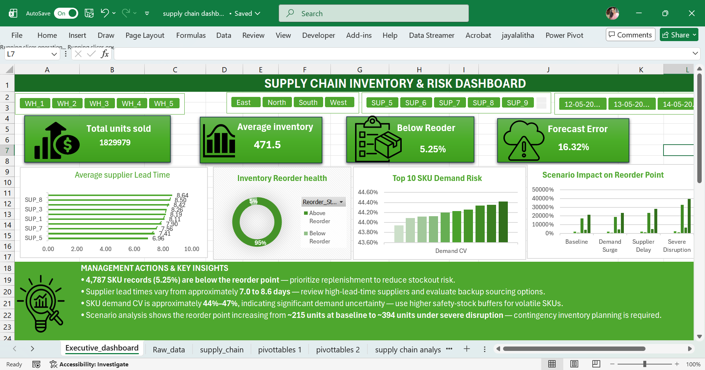

# Supply Chain Inventory & Risk Analysis

> An Excel-based decision-support dashboard for identifying inventory,
> supplier, demand and replenishment risks.

## Executive Dashboard

##  Project Demonstration

I have created a short LinkedIn video demonstrating the complete analytical workflow, including:

- Business problem definition
- PROVE framework
- Demand and supplier analysis
- Safety stock and reorder-point modeling
- Scenario Manager
- Executive dashboard
- Management insights

👉 **[Watch the Project Demonstration on LinkedIn](https://www.linkedin.com/posts/jayalalitha-t_excel-dataanalytics-supplychain-activity-7495446889987788800-j3gE?utm_source=social_share_send&utm_medium=member_desktop_web&rcm=ACoAAEoeiWkB0e6-xutgsI8rVOqUojWvjpV3Nzw)**

## Business Problem

Inventory availability is not determined only by how much stock a
business holds.

Demand variability, supplier lead times, forecast accuracy and
replenishment policies can all increase the risk of stockouts.

This project analyzes these operational drivers and converts them
into an executive-level inventory and risk dashboard using Microsoft Excel.

## Analytical Framework — PROVE

### P — Problem

Identify inventory and replenishment risks that could contribute
to stockouts and operational disruption.

### R — Research

Analyze:

- Demand patterns
- Demand variability
- Supplier lead times
- Forecast accuracy
- Inventory levels
- Reorder exposure

### O — Observe

The analysis identified:

- 4,787 records below reorder point
- 5.25% below reorder
- Demand CV approximately 44%–47%
- Supplier lead times approximately 7–8.6 days

### V — Value

A safety-stock and reorder-point model was developed using:

- Demand variability
- Lead-time variability
- Service level
- Lead-time demand

Scenario Manager was then used to evaluate demand surges,
supplier delays and severe disruptions.

### E — Execute

The findings were converted into an executive dashboard with:

- KPI cards
- Slicers
- Supplier lead-time analysis
- Inventory reorder health
- SKU demand risk
- Scenario impact analysis
- Management actions

  ## Key Findings

### Inventory Risk

4,787 SKU records were below the reorder point,
representing approximately 5.25% of the analyzed records.

### Demand Risk

SKU demand coefficient of variation ranged approximately
between 44% and 47%, indicating substantial demand variability.

### Supplier Risk

Average supplier lead times ranged from approximately
7.0 to 8.6 days.

### Scenario Impact

The modeled reorder point increased from approximately:

Baseline: 215 units

Demand Surge: 237 units

Supplier Delay: 283 units

Severe Disruption: 394 units

## Management Actions

Based on the analysis:

1. Prioritize replenishment for inventory below reorder levels.

2. Review suppliers with relatively high lead times and consider
   backup sourcing strategies.

3. Apply appropriate safety-stock buffers to SKUs with high demand
   variability.

4. Prepare contingency inventory strategies for severe disruption
   scenarios.

## Excel Techniques Used

- Excel Tables
- XLOOKUP
- PivotTables
- Pivot Charts
- Slicers
- Statistical calculations
- Demand coefficient of variation
- Safety stock calculation
- Reorder point modeling
- Scenario Manager
- Conditional formatting
- Executive dashboard design

  ## Business Impact

The dashboard provides management with a consolidated view of:

- Inventory replenishment exposure
- Supplier lead-time risk
- Demand variability
- Forecast accuracy
- Safety-stock requirements
- Potential disruption impact

This allows decision-makers to prioritize replenishment,
evaluate supplier risk and prepare inventory buffers under
different operating conditions.

## Limitations

- The analysis is based on the available historical dataset.
- Scenario assumptions are illustrative rather than predictive.
- Supplier reliability is evaluated primarily through lead-time behavior.
- The model does not incorporate procurement cost, holding cost,
  MOQ or supplier capacity constraints.

## Future Improvements

Potential extensions include:

- ABC inventory classification
- Inventory holding-cost optimization
- Supplier scorecard
- Economic Order Quantity (EOQ)
- MOQ constraints
- Supplier capacity analysis
- Automated data refresh
- Power BI implementation
- Statistical demand forecasting
